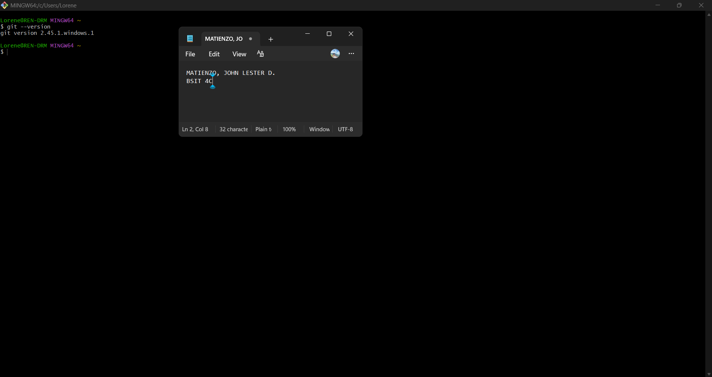
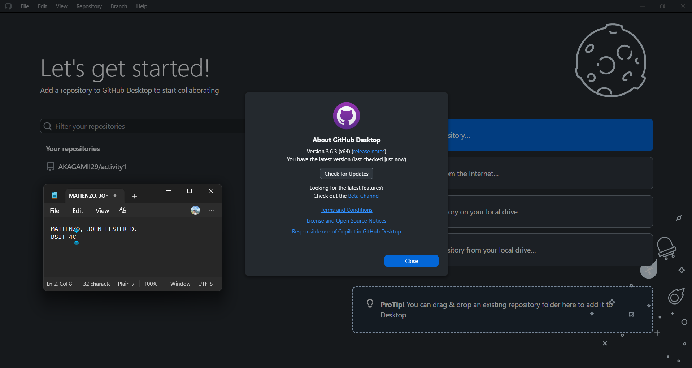
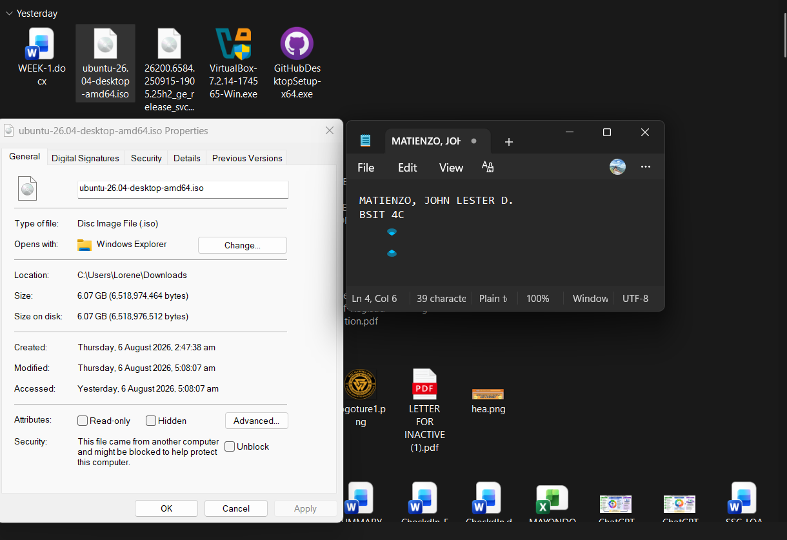
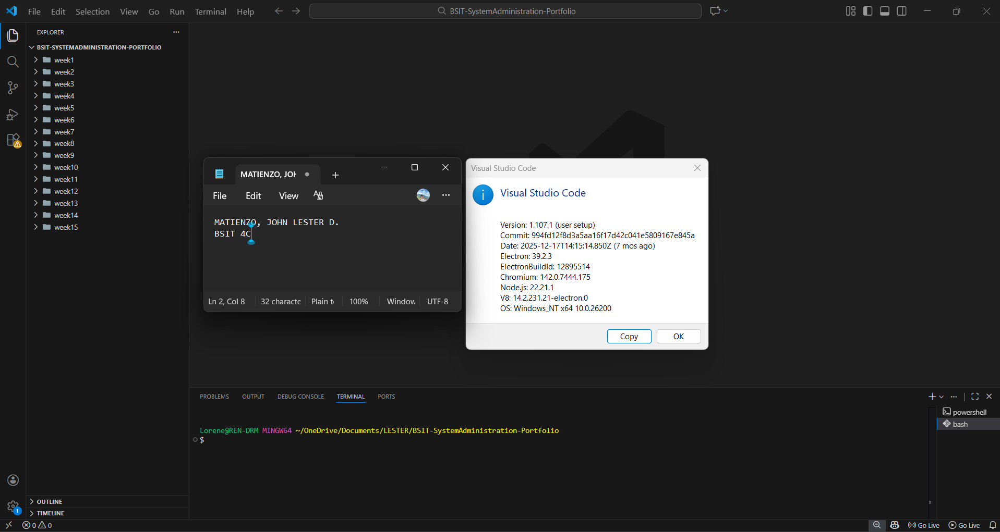
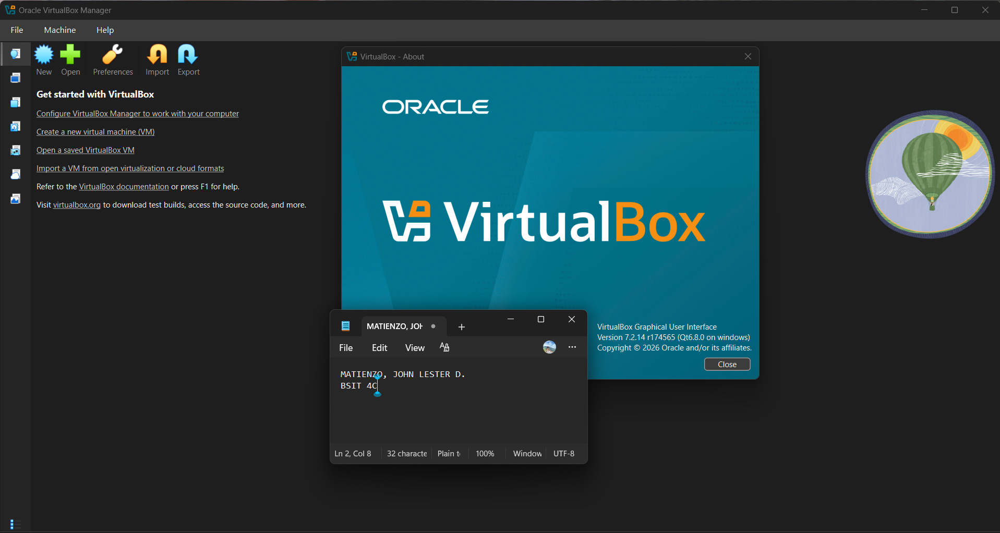
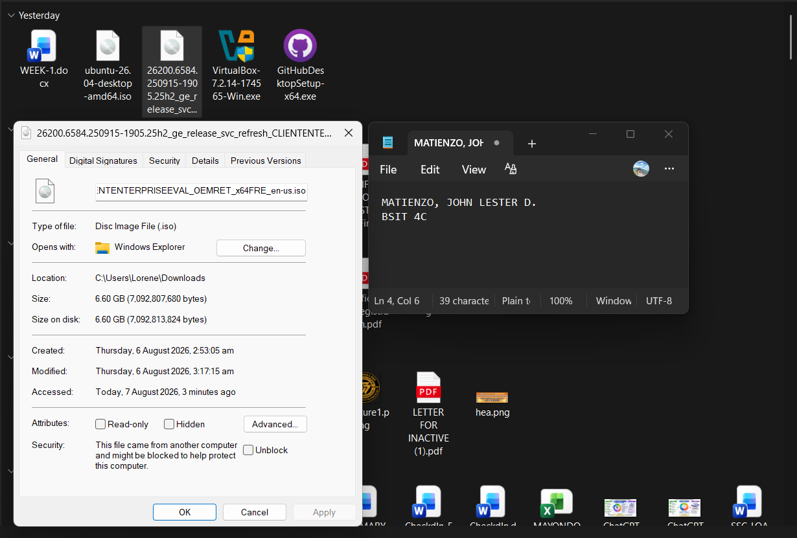

# Week 1 – Building My Professional Environment

## Student Information
	Name: John Lester De Rama Matienzo
	Course: Bachelor of Science in Information Technology
	Section: 4-C
	Date: August 03, 2026
# Objectives
    - Create a Professional Accout for both GitHub and LinkedIn
    - Install a Proffesional Software like GitHub Desktop and others
    - Create a GitHub Repository and Learn how to create a structure for it
    - Learn more on how does Git Bash works
---
# Software Installed
    - Git
    - GitHub Desktop
    - Visual Studio Code
    - Oracle VirtualBox
    - Ubuntu Desktop ISO
    - Windows 11 Enterprise Evaluation ISO
---
# Professional Accounts
GitHub: https://github.com/AKAGAMII29

LinkedIn: https://www.linkedin.com/in/john-lester-de-rama-matienzo-22383b426/

---
# Installation Screenshots
## Git

## GitHub Desktop

## Ubuntu ISO

## Visual Studio Code

## VirtualBox

## Windows ISO

---
# Challenges Encountered
    - When I create a folder for the Repository it was empty and the solution I do was to create/added a README files for each  folders.
    - After I created a local repository in VS Code it does not appear in Github and the solution i did was to pushed it using Git Commands like git add. , git commit -m and git push.
    - When I'm installing some software application some of it takes so long to download like the Windows 11 Enterprise Evaluation ISO and Ubuntu Desktop or Ubuntu Server ISO.
---
# Reflection
    There's a lot of things that I learned while doing this First Laboratory Activity. Especially in Activity 3, I learned that when you create a folder in the repository and the folder was empty the git does not track it so the solution I learned was to add a README file on it to keep the structure. Also, while doing that I remembered how to use some Git commands like the git add . , git commit -m and git push to upload my local repository to my GitHub successfully. I also encountered new software application that I need to install for this activity like the Windows 11 Enterprise Evaluation.
    This first activity also helped me to be patience while installing some of software application because some of it takes time to download and install. Learning GitHUb and some Git commands improved my ability to manage projects and tracks the changes I do on it which is a essential skills for an IT student. As a graduating student those tools will help me in my IT journey like the Github, it will help/allow me to organize files, scripts and documentation while the Ubuntu and and Windows Evaluation will help me to build my practical knowlege since both of it can be use to manage servers and network environment which align to the job I plan to apply after graduation. Overall, this activity was very helpful for me specially in the future.
---
# References
Windows ISO: https://www.microsoft.com/en-us/evalcenter/evaluate-windows-11-enterprise
Ubuntu ISO: https://ubuntu.com/download/desktop
LinkedIn: https://www.linkedin.com/
GitHub: https://github.com/
GitHub Desktop: https://desktop.github.com/download/

