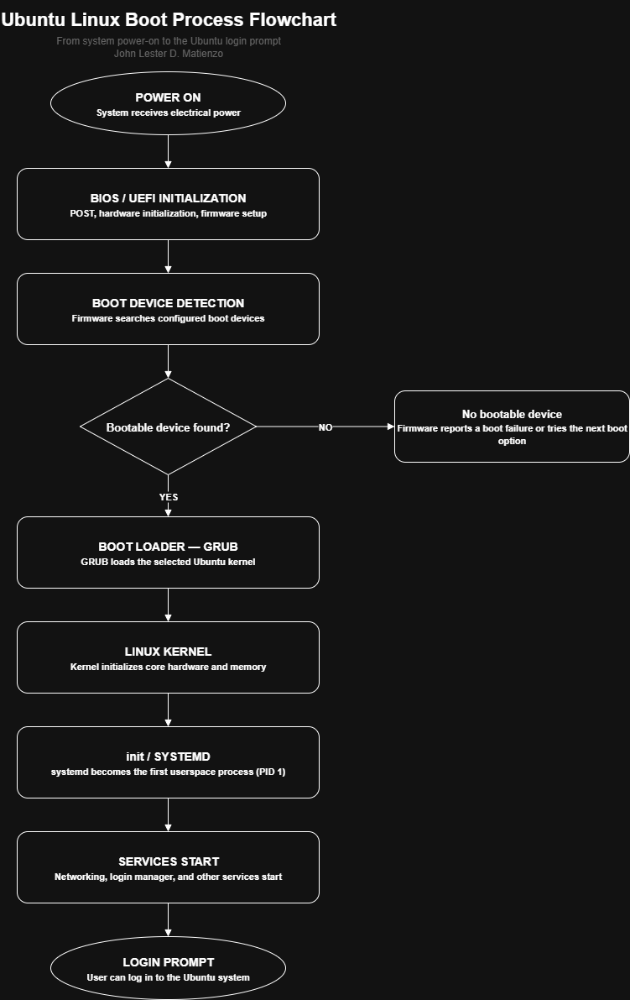

# Week 3 – Enterprise Server Deployment and Operating System Installation 
---

## Project Overview

This Week 3 activity focuses on the installation and basic configuration of two server operating systems: **Windows Server Evaluation** and **Ubuntu Server** using Oracle VM VirtualBox. The activity provided hands-on experience in deploying different server environments in a virtualized setup without affecting the host operating system.

The project covered the creation and configuration of virtual machines, attachment of ISO installation media, operating system installation, administrator setup, basic system configuration, verification using system commands, and documentation. It also included the study of BIOS and UEFI firmware and their role in the boot process of modern systems.

Through this activity, I was able to apply system administration concepts in both Windows and Linux server environments, allowing me to understand their similarities and differences in installation, configuration, and system management.

---

## Learning Objectives

The main objectives of this project were:

1. To install Windows Server Evaluation using Oracle VM VirtualBox.
2. To install Ubuntu Server using Oracle VM VirtualBox.
3. To understand the system requirements of both Windows and Linux server environments.
4. To configure virtual machines with appropriate CPU, RAM, storage, and network settings.
5. To understand BIOS and UEFI boot processes and their differences.
6. To perform basic system configuration after installation.
7. To verify successful installation using system commands in both operating systems.
8. To document the installation process using screenshots.
9. To identify installation issues and apply troubleshooting techniques.
10. To develop practical skills in multi-platform server administration.

---

## Virtual Machine Specifications

Both Windows Server and Ubuntu Server were installed using Oracle VM VirtualBox with similar base configurations.

| Component               | Specification                             |
| ----------------------- | ----------------------------------------- |
| Virtualization Software | Oracle VM VirtualBox                      |
| Operating Systems       | Windows Server Evaluation / Ubuntu Server |
| Architecture            | 64-bit                                    |
| RAM                     | 4 GB or more                              |
| CPU                     | 2 processors                              |
| Storage                 | 50–60 GB                                  |
| Network Adapter         | NAT                                       |
| Boot Mode               | BIOS/UEFI depending on configuration      |
| Installation Media      | Windows Server ISO / Ubuntu Server ISO    |

Both virtual machines were configured with sufficient resources to ensure smooth installation and basic server operation. NAT networking was used to allow internet access through the host machine.

---

## Installation Summary

### Windows Server Installation

The Windows Server installation started by creating a new virtual machine in VirtualBox and attaching the Windows Server Evaluation ISO. During setup, language, time, and keyboard settings were configured, followed by selection of the appropriate Windows Server edition.

The installation proceeded with disk partitioning, file copying, and system installation. After several restarts, the Administrator account was configured, and the system was accessed successfully.

---

### Ubuntu Server Installation

The Ubuntu Server installation followed a similar process. A new virtual machine was created, and the Ubuntu Server ISO was attached. The installation process included selecting language, keyboard layout, network configuration, and storage setup.

Ubuntu Server used a text-based installer where I configured the system hostname, user account, and password. After installation, the system was rebooted, and login was performed using the created credentials.

---

## Configuration Summary

After installation, both servers were configured and verified.

### Windows Server Configuration

* Administrator account setup
* Network configuration using NAT
* System verification using Windows commands

### Ubuntu Server Configuration

* User account creation
* Hostname configuration
* Network verification using terminal commands

### Common Verification Commands

#### Windows Server

* `hostname`
* `ipconfig`
* `systeminfo`
* `whoami`
* `winver`
* `ping 8.8.8.8`

#### Ubuntu Server

* `hostname`
* `ip addr`
* `ping -c 4 google.com`
* `sudo apt update`
* `sudo apt -y upgrade`
* `systemctl status ssh`

These commands were used to confirm that both systems were properly installed and connected to the network.

---

## Verification Results

Both operating systems were successfully installed and verified using system commands.

| System         | Verification Command | Purpose                        | Result   |
| -------------- | -------------------- | ------------------------------ | -------- |
| Windows Server | `systeminfo`         | Displays system details        | Verified |
| Windows Server | `ipconfig`           | Displays network configuration | Verified |

---

## BIOS vs UEFI Highlights

BIOS and UEFI are firmware systems responsible for initializing hardware and starting the operating system.

| Category        | BIOS                   | UEFI                           |
| --------------- | ---------------------- | ------------------------------ |
| Firmware        | Legacy system          | Modern firmware interface      |
| Boot Method     | MBR-based boot process | EFI boot manager               |
| Partition Style | MBR                    | GPT                            |
| Speed           | Slower                 | Faster                         |
| Security        | Limited                | Secure Boot support            |
| Compatibility   | Older systems          | Modern systems (Windows/Linux) |

UEFI is more suitable for modern server environments because it supports larger storage devices, faster boot times, and improved security features such as Secure Boot.

---

## Embedded Boot Process Flowchart

---

## Challenges Encountered

Several challenges were encountered during the installation of both operating systems:

* Large ISO file sizes required stable internet connection.
* Differences in installation interfaces (GUI for Windows, text-based for Ubuntu).
* Proper VM configuration was required before installation.
* Selecting correct installation options (especially Windows Server edition and Ubuntu storage setup).

These challenges were resolved by carefully reviewing installation requirements, ensuring complete ISO downloads, and double-checking virtual machine configurations before starting the installation process.

---

## Reflection

This Week 3 activity significantly improved my understanding of server operating systems by allowing me to install and configure both Windows Server and Ubuntu Server in a virtualized environment. As a BSIT 4th-year student, I realized that system administration requires flexibility in handling different platforms, as real-world environments often use both Windows and Linux servers.

One of the most important lessons I learned is that installation is only the first step in system administration. Proper configuration, verification, and troubleshooting are equally important to ensure that the system is fully functional. I also learned that Windows and Linux servers differ in installation methods, but both require careful planning in terms of system resources and network configuration.

Studying BIOS and UEFI also helped me understand how firmware affects system booting and security. UEFI’s support for GPT and Secure Boot makes it more suitable for modern server environments.

Overall, this activity strengthened my technical skills in server deployment, system configuration, and cross-platform administration, which are essential for real-world IT environments.

---

# References
---

Microsoft. (n.d.). Windows Server documentation. Microsoft Learn. https://learn.microsoft.com/en-us/windows-server/

Microsoft. (n.d.). Microsoft Evaluation Center. Microsoft. https://www.microsoft.com/en-us/evalcenter/

Microsoft. (n.d.). Windows Server 2025 Trial. Microsoft. https://info.microsoft.com/ww-landing-evaluate-windows-server-2025.html

Oracle. (n.d.). Oracle VirtualBox documentation. Oracle. https://docs.oracle.com/en/virtualization/virtualbox/

Oracle. (2024). Oracle VM VirtualBox User Guide. Oracle. https://docs.oracle.com/en/virtualization/virtualbox/7.0/user/index.html

Microsoft. (n.d.). Boot to UEFI mode or legacy BIOS mode. Microsoft Learn. https://learn.microsoft.com/en-us/windows-hardware/manufacture/desktop/boot-to-uefi-mode-or-legacy-bios-mode

Canonical. (2026). Ubuntu Server documentation. Ubuntu. https://documentation.ubuntu.com/server/

Canonical. (2026). Basic installation. Ubuntu Server Documentation. https://documentation.ubuntu.com/server/tutorial/basic-installation/

Canonical. (2026). Install and manage packages. Ubuntu Server Documentation. https://documentation.ubuntu.com/server/how-to/software/package-management/

Canonical. (2026). OpenSSH server. Ubuntu Server Documentation. https://documentation.ubuntu.com/server/how-to/security/openssh-server/

Oracle. (n.d.). Oracle VirtualBox documentation. Oracle. https://docs.oracle.com/en/virtualization/virtualbox/

---

